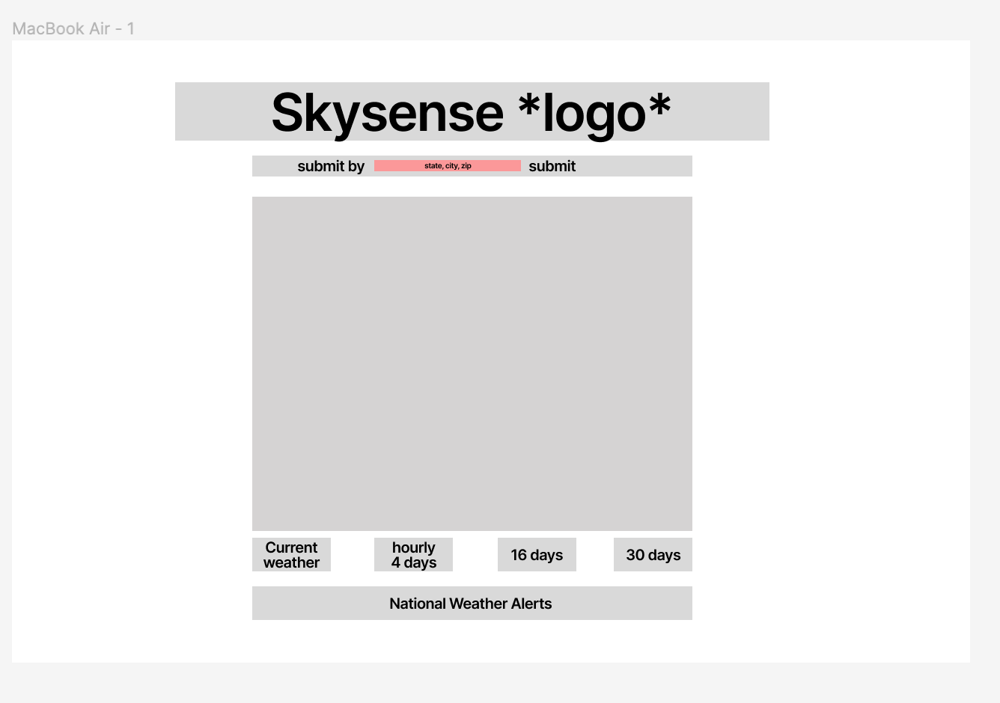

# Skysense Weather App

**Skysense** is a weather app that allows users to access weather information for their desired location. Whether you want to check the current weather or plan ahead for the next few days or even weeks, **Skysense** has you covered. The app utilizes the Weather API provided by OpenWeatherMap to fetch accurate and up-to-date weather data.

| Feature                         |                                                                                                                       Descriptions                                                                                                                        |
| ------------------------------- | :-------------------------------------------------------------------------------------------------------------------------------------------------------------------------------------------------------------------------------------------------------: |
| **Current Weather**             |                        Users can simply enter their state, city, or zip code to view the current weather conditions in their area. The app will display essential information such as temperature, humidity, wind speed, and more.                        |
| **Hourly Forecast (4 days)**    |                  Get a detailed hourly weather forecast for the next four days. This feature helps users plan their day effectively by providing information about temperature changes, precipitation, and other relevant weather data.                   |
| **Daily Forecast (16 days)**    |                           **Skysense** offers a comprehensive daily weather forecast for the next 16 days. Users can stay prepared for upcoming weather patterns and make informed decisions based on the predicted conditions.                           |
| **Extended Forecast (30 days)** |                        For those who like to plan well in advance, **Skysense** provides an extended forecast for the next 30 days. This feature allows users to anticipate weather trends and adjust their schedules accordingly.                        |
| **National Weather Alerts**     |                               Stay informed about any national weather alerts or warnings that may affect your area. Skysense ensures that users receive critical weather information to help them stay safe and prepared.                                |
| **Default Location**            | The app's default location is set to Asheville, NC, where the creator resides. However, future enhancements aim to implement geo-location, allowing the browser to automatically request the user's location and display weather information accordingly. |

## **Wire Frames**
